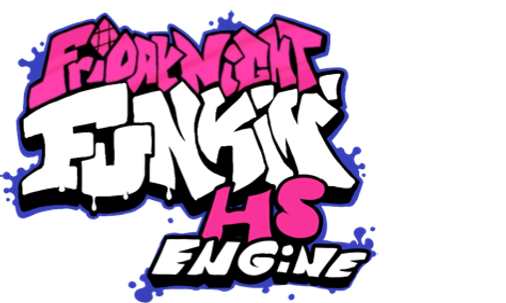

# HS Engine

<p style="margin-top: -100px;">
  
</p>

This is the repository of Friday Night Funkin': HS Engine.

## ModAPI

(ModAPI coming out soon :0)

## Credits

### HS Engine Developers
| Credits Icon | Username | Involvement |
| ------------ | -------- | ----------- |
|  | [HaxelDev](https://github.com/HaxelDev) | Main-Programmer of HS Engine
|  | [teotm](https://github.com/teotm) | Ex-Programmer of HS Engine
|  | [Codding Cat](https://github.com/CoddingCatPL) | Ex-Programmer of HS Engine
|  | [Wipek](https://www.youtube.com/watch?v=lrJLIE3jGOs) | Artist of HS Engine

### HS Engine Owner
| Credits Icon | Username | Involvement |
| ------------ | -------- | ----------- |
|  | [Gidk](https://www.youtube.com/watch?v=al74RjD4Ans) | HS engine owner (he resigned to be a programmer for this engine because he went to buy some milk lol)

### Special Thanks
| Credits Icon | Username | Involvement |
| ------------ | -------- | ----------- |
|  | [Shadow Mario](https://twitter.com/Shadow_Mario_) | Some Stolen Stuff
|  | [CoreCat](https://github.com/Core5570RYT) | Some Stolen Stuff

### Friday Night Funkin'
| Credits Icon | Username | Involvement |
| ------------ | -------- | ----------- |
|  | [ninja_muffin99](https://twitter.com/ninja_muffin99) | Programmer of Friday Night Funkin'
|  | [PhantomArcade3K](https://twitter.com/PhantomArcade3K) | Artist of Friday Night Funkin'
|  | [evilsk8r](https://twitter.com/evilsk8r) | Artist of Friday Night Funkin'
|  | [Kawai Sprite](https://twitter.com/kawaisprite) | Composer of Friday Night Funkin'

## Build instructions

**Warning: Make sure to use Haxe version 4.2.5 as versions like 4.3.4 will not work properly with this engine.**

First you need to install Haxe and HaxeFlixel.
1. [Install Haxe 4.2.5](https://haxe.org/download/version/4.2.5/) (Download 4.2.5 instead of 4.1.5, seriously stop using Haxe 4.1.5, it misses a lot of stuffs)
2. Download [git-scm](https://git-scm.com/downloads). Works for Windows, Mac, and Linux, just select your build.
3. Next go install the necessary Haxe libraries in order to compile your mod by typing these commands in:
```cmd
haxelib install hmm
haxelib run hmm install
```

You should have everything ready for compiling the engine! Follow the guide below to continue!
